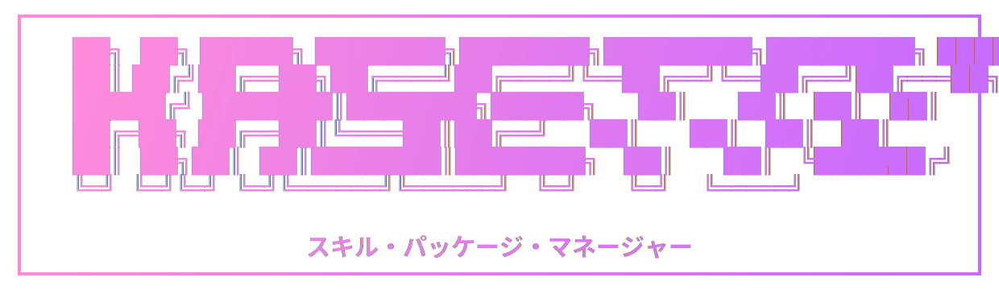

---
hide:
  - navigation
  - toc
  - footer
title: ""
---

<style>
.md-content > .md-content__inner > h1 { display: none; }
.md-tabs { display: none; }
</style>

<div class="kst-hero" markdown>


<p class="kst-tagline">An extremely fast AI skills manager, written in Rust.</p>

<div class="kst-install" markdown>

```bash
curl -fsSL https://raw.githubusercontent.com/pivoshenko/kasetto/main/scripts/install.sh | sh
```

</div>

<div class="kst-buttons">
  <a href="getting-started/" class="kst-btn-primary">Get started →</a>
</div>

</div>

<p class="kst-section-title">Why Kasetto</p>

<div class="kst-features" markdown>

<div class="kst-feature" markdown>

:material-file-document-edit-outline:{ .kst-feature-icon }

### Declarative

</div>

<div class="kst-feature" markdown>

:material-source-branch:{ .kst-feature-icon }

### Multi-source

</div>

<div class="kst-feature" markdown>

:material-robot-outline:{ .kst-feature-icon }

### Agent-agnostic

</div>

<div class="kst-feature" markdown>

:material-file-search-outline:{ .kst-feature-icon }

### Traceable

</div>

<div class="kst-feature" markdown>

:material-cog-outline:{ .kst-feature-icon }

### CI-friendly

</div>

<div class="kst-feature" markdown>

:material-package-variant-closed:{ .kst-feature-icon }

### Single binary

</div>

</div>
