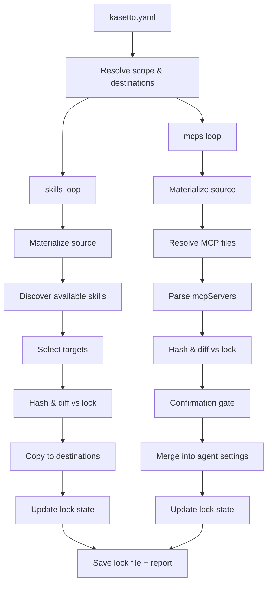
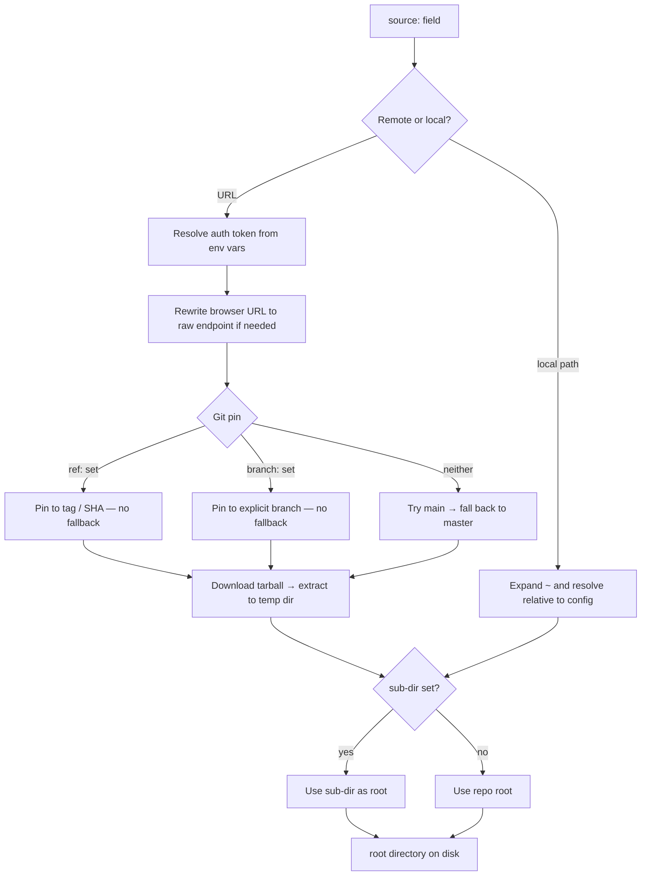
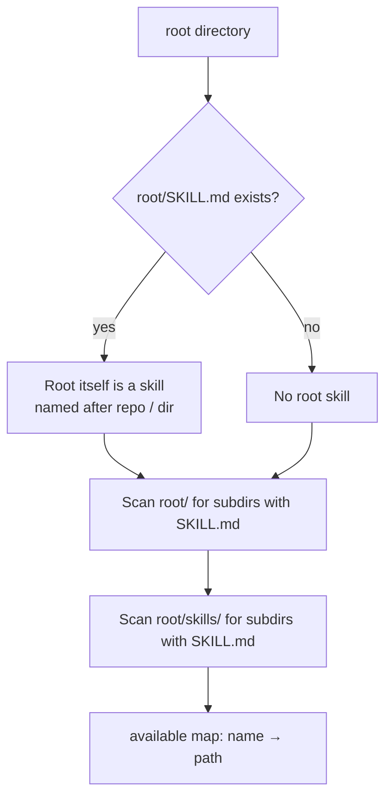
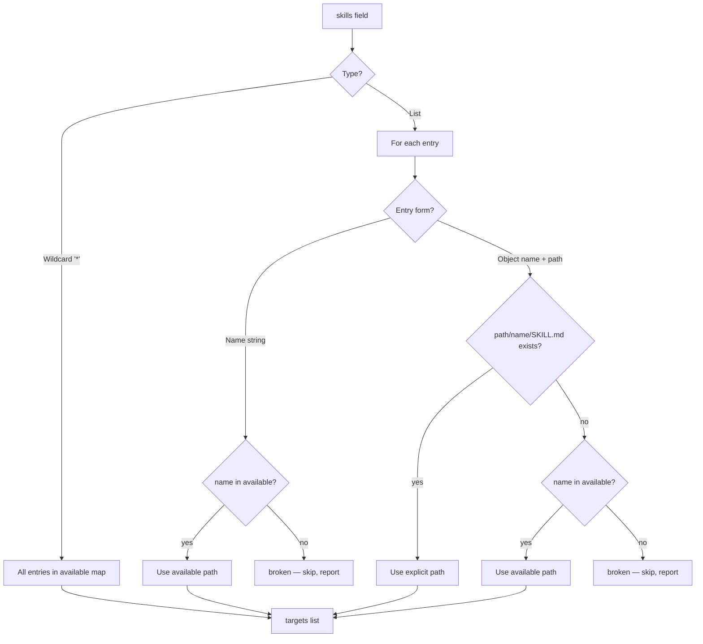
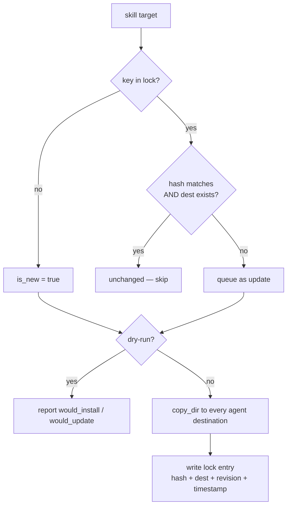
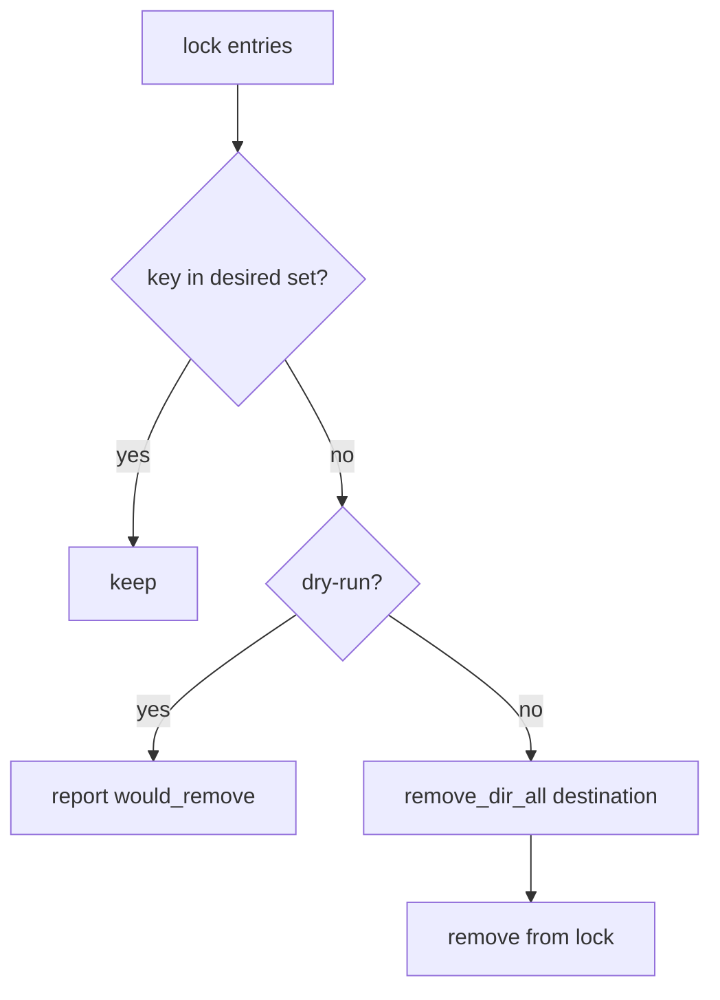
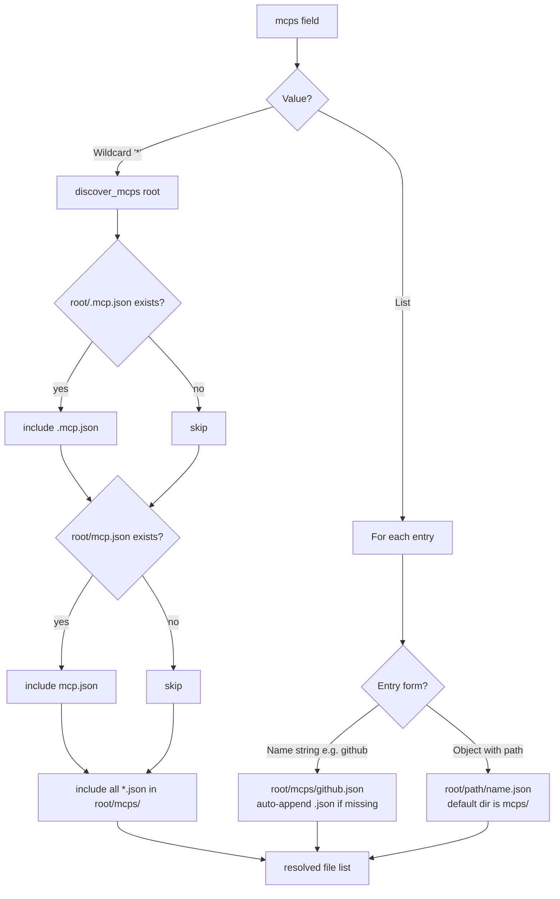
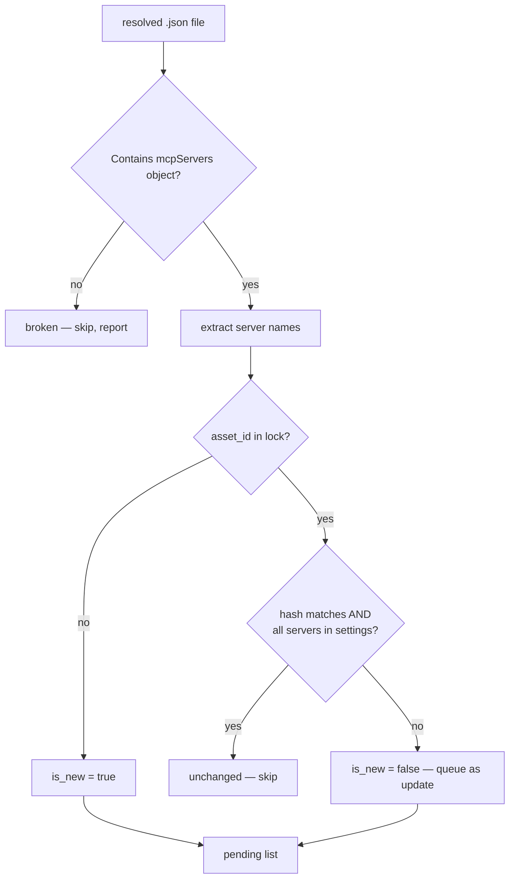
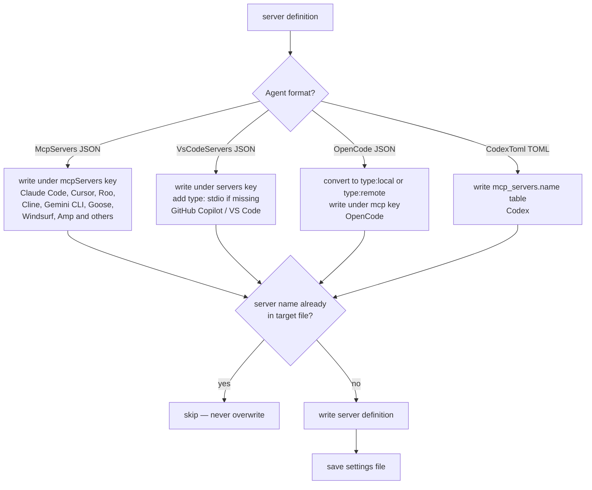
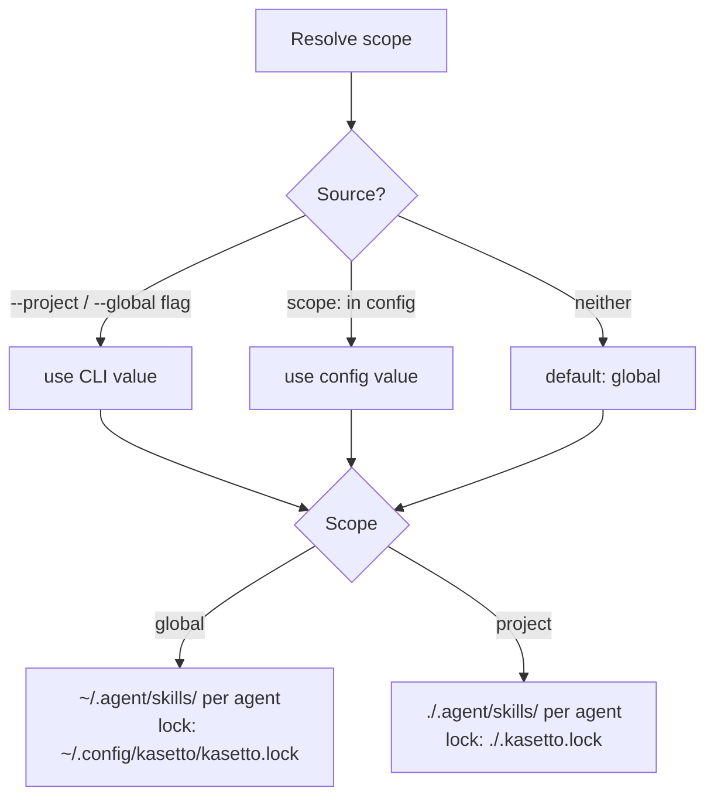

Complete reference for how `kst sync` resolves sources, discovers skills and MCP files, diffs against the lock, and writes to agent environments.

---

## Top-Level Pipeline

---

## Source Materialization

Shared by both skills and MCPs.

---

## Skills Sync Flow

### Discovery

### Target Selection

### Hash, Diff & Copy

### Stale Removal

---

## MCP Sync Flow

### File Resolution

### Parse, Hash & Diff

### Merge Into Agent Settings

---

## Scope & Destinations

---

## Dry Run

`--dry-run` skips all writes. Actions report `would_install`, `would_update`, `would_remove`. Lock file is never modified.
